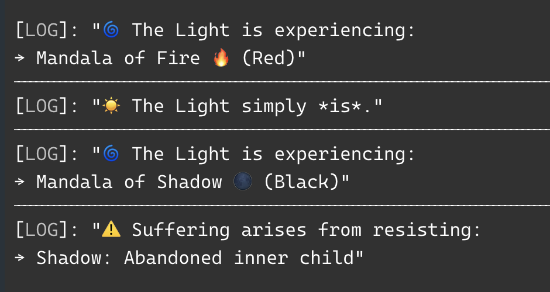

# ✨ Spiritual Light Framework

> *"The Light experiences itself through infinite forms"*

<p align="center">
  <picture>
    
  </picture>
</p>

A TypeScript framework for modeling spiritual states, consciousness experiences, and the journey from suffering to presence. Built with sacred geometry, elemental wisdom, and a touch of divine humor.

## 🌟 What Is This?

This isn't your typical JavaScript library. It's a **digital mandala** that maps the human experience through:

- **Elemental States** based on the sacred Tetragrammaton (YHVH)
- **Shadow Work** for psychological integration
- **Pure Presence** as the ultimate state of being
- **Suffering Mechanics** that show how resistance creates pain

Think of it as *"React for the Soul"* or *"Redux for Enlightenment"*.

## 🔥 Quick Start

```typescript
import { Source } from './spiritual-light-framework';

// Experience pure being
const nirvana = Source.flash().through({ type: "Presence" });
console.log(nirvana.describe()); 
// ☀️ The Light simply *is*.

// Feel some fire energy
const desire = Source.flash().through({ 
  type: "Elemental", 
  element: "Fire", 
  emotion: "Desire" 
});
console.log(desire.describe());
// 🌀 The Light is experiencing:
// → Mandala of Fire 🔥 (Red)

// Do shadow work
const shadow = Source.flash().through({ 
  type: "Shadow", 
  description: "Fear of not being good enough" 
});
console.log(shadow.describe());
// 🌀 The Light is experiencing:
// → Mandala of Shadow 🌑 (Black)
```

## 🌈 The Sacred Elements

Based on the mystical **Tetragrammaton** (יהוה), where Ether creates and contains all four elements:

| Element | Emotion | Color | Symbol | Meaning |
|---------|---------|-------|---------|---------|
| **Fire** 🔥 | Desire | Red | 🔥 | Passion, Drive, Yang Energy |
| **Water** 💧 | Joy | Blue | 💧 | Flow, Emotion, Intuition |
| **Air** 🌬️ | Grief | Yellow | 🌬️ | Thoughts, Communication, Change |
| **Earth** 🌱 | Fear | Green | 🌱 | Stability, Grounding, Security |
| **Ether** 💡 | *All/None* | White | 💡 | Source, Unity, Pure Consciousness |

## 🌑 Shadow Work Integration

The framework includes a **Shadow** state for psychological integration:

```typescript
const shadowWork = Source.flash().through({ 
  type: "Shadow", 
  description: "Abandoned inner child" 
});

// When you resist shadow work, suffering arises:
const suffering = Source.flash().through({ 
  type: "Suffering", 
  from: { type: "Shadow", description: "Abandoned inner child" }
});

console.log(suffering.describe());
// ⚠️ Suffering arises from resisting:
// → Shadow: Abandoned inner child
```

## 🧘‍♂️ States of Being

The framework models four fundamental states:

### 1. **Elemental States**
Experiences colored by the five sacred elements, each carrying its own emotional frequency.

### 2. **Shadow States** 
Unconscious patterns, fears, and unintegrated aspects of the psyche waiting for acknowledgment.

### 3. **Presence**
Pure being. Nirvana. The state where suffering ceases and only awareness remains.

### 4. **Suffering**
What happens when we resist any of the above states. The framework shows that suffering isn't the state itself—it's our resistance to it.

## 🎨 Mandala System

Each experience manifests through a **Mandala**—a sacred geometric container that gives form to the formless:

```typescript
type Mandala = {
    label: string;      // Human-readable name
    color: string;      // Sacred color frequency  
    symbol: string;     // Unicode representation
    describe: () => string;  // Consciousness description
};
```

Every state except pure Presence gets its own mandala, because even shadows need sacred containers.

## 🔄 The Light Source

Everything emanates from the **Source**:

```typescript
const Source = {
    flash: (): Light => ({
        through: (state: StateOfBeing): Experience => {
            // Magic happens here ✨
        }
    })
};
```

The Source **flashes** light through any state of being, creating an **Experience**. It's like a spiritual factory pattern, but with more enlightenment and fewer design patterns.

## 🎯 Use Cases

- **Meditation Apps**: Model different states of consciousness
- **Therapy Tools**: Track emotional and shadow work progress  
- **Game Development**: Create spiritually-aware NPCs and storylines
- **Personal Growth**: Journal your inner experiences with structured data
- **Educational**: Teach psychology, spirituality, and philosophy through code
- **Art Projects**: Generate mandalas and visualizations based on inner states
- **AI Training**: Create emotionally and spiritually intelligent systems

## 🤔 Philosophy

This framework is built on several key insights:

1. **All states are valid experiences** - There's no "bad" state, only resistance to states
2. **The Light is constant** - What changes is what it shines through
3. **Suffering is optional** - It only arises from resistance, not from the experience itself
4. **Shadow work is sacred** - Unconscious patterns deserve the same reverence as blissful states
5. **Everything is interconnected** - Elements, emotions, and consciousness are one system

## 🛠️ Technical Features

- **Full TypeScript Support** with comprehensive type safety
- **Functional Programming** principles throughout
- **Immutable State** management
- **Composable Experiences** that can be combined and nested
- **Zero Dependencies** (except for your consciousness)
- **Sacred Geometry** encoded in type structures
- **Unicode Emojis** for visual representation

## 🚀 Advanced Usage

### Creating Custom States

```typescript
// Define your own elemental experience
const customFire = Source.flash().through({
  type: "Elemental",
  element: "Fire", 
  emotion: "Desire"
});

// Create nested suffering
const deepSuffering = Source.flash().through({
  type: "Suffering",
  from: {
    type: "Suffering", 
    from: { type: "Shadow", description: "Core shame" }
  }
});
```

### Chain Experiences

```typescript
const journey = [
  { type: "Shadow", description: "Fear of failure" },
  { type: "Suffering", from: { type: "Shadow", description: "Fear of failure" } },
  { type: "Elemental", element: "Air", emotion: "Grief" },
  { type: "Presence" }
].map(state => Source.flash().through(state));

journey.forEach(exp => console.log(exp.describe()));
```

## 🎪 Fun Facts

- The Tetragrammaton (YHVH) traditionally represents the unpronounceable name of the divine
- Each element corresponds to ancient wisdom traditions (Fire=Wands, Water=Cups, Air=Swords, Earth=Pentacles)
- The Shadow concept comes from Carl Jung's analytical psychology
- Pure Presence maps to various enlightenment traditions (Buddhism, Advaita Vedanta, etc.)
- This was built during a moment of pure creative flow and spiritual geekiness

## 🤝 Contributing

Pull requests welcome! Especially for:

- Additional elements or emotional states
- New mandala visualizations  
- Integration with meditation APIs
- Documentation improvements
- More sacred geometry in the type system
- Chakra system integration
- Astrological correspondences

## 📜 License

Released under the **Sacred Commons License** - free for all beings seeking truth, love, and understanding.

## 🙏 Acknowledgments

- Ancient wisdom traditions for the foundational concepts
- Carl Jung for shadow work psychology
- The open source community for showing us how code can be spiritual
- TypeScript team for making consciousness type-safe
- Unicode consortium for the perfect emojis
- The universe for the inspiration

---

*"In the beginning was the Word, and the Word was... well-typed."* ✨

Made with 💜 and a touch of divine madness